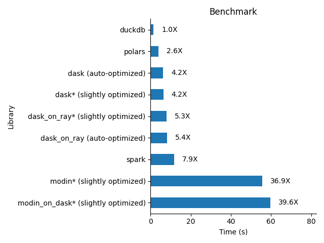
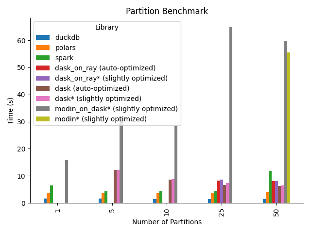

# Medium Data Bakeoff

A simple benchmark for python-based data processing libraries.

## Guiding Principles:

- Python Only: I have no intention of using another language to process data. That said, non-Python implementations with Python bindings are perfectly fine (e.g. Polars).
- Single Node: I'm not interested in benchmarking performance on clusters of multiple machines.
- Simple Implementation: I'm not interested in heavily optimizing the benchmarking implementations. My target user is myself: somebody who largely uses pandas but would like to either speed up their computations or work with larger datasets than fit in memory on their machine.


## Libraries:

- [Dask*](https://www.dask.org/)
- [dask-sql](https://dask-sql.readthedocs.io/en/latest/)
- [DuckDB](https://duckdb.org/)
- [Polars](https://www.pola.rs/)
- [Spark](https://spark.apache.org/docs/latest/api/python/)
- [Vaex](https://vaex.io/)

\*Dask required a slight, non-beginner optimization to successfully run it on my machine. Specifically, I had to do "manual column projection" by passing in the relevant calculation columns when reading in the dataset. I consider the Dask results to be slightly cheating, although this hack [may be resolved](https://github.com/dask/dask/issues/7933) natively in Dask in the not so distant future.


## Results:

The following results are from running the benchmark locally on my desktop that has:
- Intel Core i7-7820X 3.6 GHz 8-core Processor (16 virtual cores, I think)
- 32 GB DDR4-3200 RAM.
- Ubuntu 16.04 😱

Original 50-partition dataset:



Bakeoff as a function of partitions:



# The Bakeoff

## Dataset

The New York City bikeshare, [Citi Bike](https://citibikenyc.com/homepage), has a real time, [public API](https://ride.citibikenyc.com/system-data). This API conforms to the [General Bikeshare Feed Specification](https://github.com/NABSA/gbfs/blob/master/gbfs.md). As such, this API contains information about the number of bikes and docks available at every station in NYC.

Since 2016, I have been pinging the public API every 2 minutes and storing the results. The benchmark dataset contains all of these results, from 8/15/2016 - 12/8/2021. The dataset consists of a collection of 50 CSVs stored [here](https://www.kaggle.com/datasets/rosenthal/citi-bike-stations) on Kaggle. The CSVs total almost 27 GB in size. The files are partitioned by station.

For the benchmark, I first convert the CSVs to snappy-compressed parquet files. This reduces the dataset down to ~4GB in size on disk.

## Computation

To start, the bakeoff computation is extremely simple. It's almost "word count". I calculate the average number of bikes available at each station across the full time period of the dataset. In SQL, this is basically

```mysql
SELECT
  station_id
  , AVG(num_bikes_available)
FROM citi_bike_dataset
GROUP BY 1
```

Since the files are partitioned by station, predicate pushdown likely plays a large benefit for this computation.

# Setup

## Kaggle

The benchmark data is stored [here](https://www.kaggle.com/datasets/rosenthal/citi-bike-stations) in Kaggle. In order to access this data, you must create a Kaggle account and obtain an API key. You can obtain a key by clicking on your icon on the upper right of the homepage, clicking Account, and then clicking to create a new API token. This will allow you to download a `kaggle.json` credentials file which contains the API key.

## Local Setup

Move the `kaggle.json` file that you downloaded during the Kaggle setup to `~/.kaggle/kaggle.json`.

Install poetry, and then use poetry to install the `medium-data-bakeoff` library:

```commandline
poetry install
```

`medium-data-bakeoff` comes with a CLI that you can explore. Run the following for more info about the CLI.

```commandline
python -m medium_data_bakeoff --help
```

Run the following to run the full benchmark:

```commandline
python -m medium_data_bakeoff make-dataset && python -m medium_data_bakeoff bakeoff
```

## Docker setup

_Note: I haven't fully tested this!_

Copy your `kaggle.json` file that you created during the Kaggle setup to the root directory of this repo.

Build the docker container and then run the benchmark:

```commandline
docker build -t medium-data-bakeoff .
docker run -t medium-data-bakeoff python -m medium_data_bakeoff  && python -m medium_data_bakeoff bakeoff
```

Copy the results out of the container

```commandline
docker cp medium-data-bakeoff:/app/results/* .
```

# TODO:

- Run benchmarks on AWS for reproducibility.
- Run benchmarks as a function of number of CPUs.
- Add some harder benchmark computations.
- Add more libraries (e.g. `cudf`).
- Benchmark memory usage.
